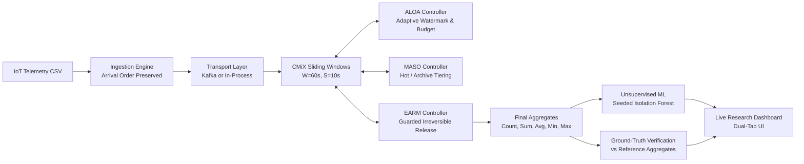

# Adaptive Out-of-Order IoT Stream Processing Framework

> **CMiX · ALOA · MASO · EARM · Online Anomaly Detection · Event-Time Correctness**  
> *A high-throughput, memory-adaptive stream processing architecture for handling high-volume, out-of-order IoT time-series telemetry.*

---

## 🌟 Executive Overview

Modern Internet of Things (IoT) stream processing systems frequently encounter high degrees of **out-of-order (OOO)** data arrivals caused by network latency, device connectivity drops, multi-hop routing, and bursty retransmissions. Traditional sliding-window stream processing engines (e.g., standard streaming aggregations) either keep window state indefinitely in memory—leading to unbounded state growth and out-of-memory (OOM) crashes—or aggressively discard late arrivals, violating aggregate correctness.

This framework introduces a cooperative four-tier architecture that substantially reduces active in-memory state and peak RSS while preserving strict event-time aggregate correctness across out-of-order telemetry streams:

1. **CMiX (Circular Matrix In-Memory eXecution)**: High-performance sliding window aggregation ($W=60s, S=10s$) with late-event reconciliation.
2. **ALOA (Adaptive Lateness & Order-Aware Controller)**: Dynamically regulates the allowed lateness budget and monotonic watermark based on empirical stream inversion rates and memory pressure.
3. **MASO (Memory-Aware State Organization)**: Manages state transitions across three tiers: **HOT** (active updates) $\rightarrow$ **ARCHIVE** (finalized, retained for reconciliation) $\rightarrow$ **FROZEN** (safely evicted).
4. **EARM (Event-Time Adaptive Retention Management)**: Enforces guarded irreversible state eviction to permanently reclaim memory once windows pass an empirical safety horizon.
5. **Unsupervised ML Anomaly Detection**: Modular feature extraction over event-time window aggregates evaluated via a seeded Isolation Forest.

---

## 🏗️ Architecture & Pipeline Flow



### State Lifecycle Tiers
- **HOT Tier**: Actively receiving and updating incoming events falling within current sliding windows.
- **ARCHIVE Tier**: Finalized windows whose end is behind the watermark, maintained temporarily to absorb late arrivals via safe reconciliation.
- **FROZEN Tier**: Summaries safely emitted and purged from physical RAM when $end + guard \le watermark$.

---

## 📊 Validated Reference & Benchmark Results

The evaluated architecture was benchmarked across multi-scenario out-of-order workloads (Baseline, Mild OOO, Moderate OOO, Heavy OOO, and Burst OOO) up to a flagship **5,000,000-event** dataset.

### 5M Flagship Workload Summary

| Metric | CMiX Baseline (Unbounded) | Full Adaptive Pipeline (CMiX + ALOA + MASO + EARM) | Trade-off / Impact |
|---|---|---|---|
| **Peak Hot State** | 5,025,321 entries | **469 entries** | **99.9907% reduction** |
| **Final Hot State** | 5,025,321 entries | **409 entries** | Drastic memory footprint reduction |
| **Frozen Emissions** | 0 entries | **4,712,336 entries** | Continuously released from RAM |
| **Peak RSS** | 1,678.0 MB | **1,042.8 MB** | **~37.9% memory reduction** |
| **Late-after-Eviction** | 0 | **0 observed** | Zero data loss in evaluated workloads |
| **Correctness vs Spark** | **EXACT (0/0/0)** | **EXACT (0/0/0)** | Matches Spark reference ground truth |
| **Throughput** | 30,240 ev/s | 10,220 ev/s | Coordination overhead trade-off |

> **Scientific Finding**: The evaluated architecture substantially reduces active state and observed memory while preserving aggregate correctness on the evaluated OOO workloads, with processing throughput as the primary engineering trade-off.

---

## ⚡ Quickstart: One-Command Live Demo

Launch both the standard library REST API server and the real-time research dashboard with a single command:

```bash
python run_demo.py
```

Open your browser at:
👉 **`http://localhost:8765`**

### Command Options
```bash
python run_demo.py --port 8765 --host 127.0.0.1 --open
```

---

## 🖥️ Dashboard Overview

The dashboard is structured into two clean, dedicated sections:

### Tab 1 — Live Demo (Online Stream Processing)
- **Dataset Ingestion & Profiling**: Drag-and-drop any IoT CSV (or 1-click load pre-packaged samples `sample_ooo_2k.csv` or `sample_ooo.csv`). Computes out-of-order percentage, max lateness, timespans, and generates side-by-side arrival order vs event-time order previews.
- **Pipeline Stage Visualizer**: Visualizes data flow through `CSV Ingest` → `OOO Stream` → `CMiX` → `ALOA` → `MASO` → `EARM` → `Aggregates` → `Isolation Forest` with live state indicators.
- **Live Progress & KPIs**: Real-time progress bar, events/sec ticker, peak hot state, state reduction %, peak RSS, and frozen emission counters.
- **Ground-Truth Correctness Verification**: Derives exactness status directly from underlying `missing`, `extra`, and `mismatch` counts against independent reference calculation ($tolerance = 10^{-6}$).
- **Mechanism Comparison Matrix**: Compares CMiX, ALOA, MASO, and Full pipelines executed live on the uploaded dataset.
- **Live Canvas Charts**: Renders throughput trajectories, state trajectories (Hot vs Archive), anomaly score distributions (histogram), and lateness distributions.
- **Unsupervised Anomaly Detection**: Displays anomaly counts, percentages, distribution statistics, and an anomalous window drill-down table.
- **JSON Export**: Export the full execution bundle (metrics, profile, ML output, correctness report).

### Tab 2 — Precomputed Research Results
- Complete visualization of the offline benchmark matrix across datasets (50K, 200K, 5M) and disorder scenarios.
- Allows switching between mechanisms (CMiX, Fixed-2s, Fixed-5s, Fixed-10s, ALOA, MASO, Full, EARM-Agg) to inspect peak hot state, state reduction %, RSS, throughput, and lateness trajectories.

---

## 📁 Repository Structure

```text
bda-iot-stream-processing-main/
├── run_demo.py                     # Root one-command launcher
├── requirements.txt                # Project dependencies
├── README.md                       # Comprehensive project documentation
├── AGENTS.md / GEMINI.md           # Architectural rules & invariants
├── FINAL_RESULTS.md                # Reference experiment benchmark notes
├── REPRODUCE.md                    # Detailed reproduction guidelines
├── START_HERE.md                   # Getting started guide
├── data/
│   ├── demo/                       # Demo datasets (sample_ooo.csv, sample_ooo_2k.csv)
│   └── workloads/                  # Workload scenario definitions
├── docs/
│   ├── PLAN.md                     # Implementation roadmap
│   └── SPEC_SUMMARY.md             # Formal architectural specification
├── frontend/
│   ├── index.html                  # Dual-tab research & engineering UI
│   ├── dashboard.py                # Standalone static file server
│   └── assets/
│       └── results_bundle.json     # Precomputed benchmark reference bundle
├── scripts/
│   ├── run_demo.py                 # Script runner alias
│   ├── terminal_demo.py            # Terminal live execution script
│   ├── run_final_experiments.py    # Multi-scenario experiment runner
│   └── run_flagship.py             # 5M flagship benchmark execution
├── src/
│   ├── bda/
│   │   ├── cmix/                   # CMiX core sliding window aggregation
│   │   ├── aloa/                   # ALOA adaptive lateness controller & policy
│   │   ├── maso/                   # MASO memory-aware state organizer
│   │   ├── earm/                   # EARM adaptive retention management
│   │   ├── eval/                   # Aggregate correctness comparison engine
│   │   ├── pipeline/
│   │   │   ├── ingest.py           # Arrival-order CSV validator & profiler
│   │   │   └── stream.py           # Unified streaming pipeline & fallback engine
│   │   ├── ml/
│   │   │   ├── features.py         # Window aggregate feature extraction
│   │   │   └── detector.py         # Seeded Isolation Forest anomaly detector
│   │   └── api/
│   │       └── server.py           # Stdlib HTTP REST API & static server
│   ├── common/                     # Config, event schemas, Spark ground truth
│   ├── data/                       # Canonicalization utilities
│   └── streaming/                  # Kafka injector & Spark baselines
└── tests/
    ├── test_cmix_correctness.py    # Unit tests for CMiX, ALOA, MASO, EARM
    ├── test_api_and_pipeline.py    # End-to-end integration & API tests
    └── verify_live_flow.py         # Automated live flow verification script
```

---

## 🧪 Testing & Verification

The test suite validates data ingestion, disorder generation, state transitions, EARM safe release, ML anomaly scoring, and all REST endpoints.

Run the test suite:
```bash
pytest -q
```

Expected output:
```text
............                                                             [100%]
12 passed in 4.59s
```

Run the terminal live demo:
```bash
python scripts/terminal_demo.py
```

---

## 🛡️ Core Architectural Rules & Invariants

1. **Strict Arrival-Order Preservation**: Telemetry is consumed in file/stream arrival order. No global pre-sorting is permitted. Event time is derived strictly from the `Timestamp` column.
2. **Algorithm Preservation**: Core algorithms inside `src/bda/cmix`, `src/bda/aloa`, `src/bda/maso`, and `src/bda/earm` are wrapped and orchestrated without rewriting their internal logic.
3. **Transparent Transport**: Automatically utilizes Apache Kafka (`localhost:9092`) when running. If unavailable, falls back to an in-process queue visibly labeled in both the API and UI.
4. **Honest Evaluation**: Correctness is verified directly against independent ground truth (`missing == 0`, `extra == 0`, `mismatches == 0`).
5. **Deterministic ML**: Anomaly detection employs an unsupervised `IsolationForest` with fixed seeds (`random_state=42`) trained strictly on event-time aggregates, reporting honest unsupervised metrics.

---

## 📜 Citation & Research Notes

If referencing or reproducing this work:
```bibtex
@misc{bda_iot_stream_processing,
  title={Adaptive Out-of-Order IoT Stream Processing: CMiX, ALOA, MASO, and EARM},
  author={BDA Research Team},
  year={2026}
}
```
