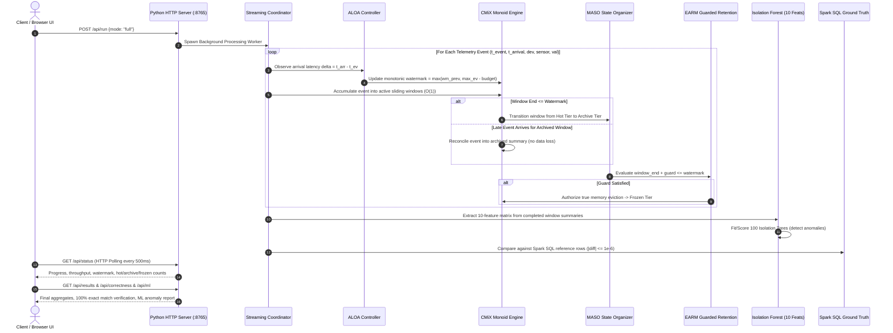

# Adaptive IoT Stream Analytics (AISA): Fault-Tolerant, Memory-Bounded Window Aggregation over Disordered Out-of-Order Sensor Streams

[]()
[]()
[]()
[]()
[]()
[]()

---

## Executive Summary

In Internet-of-Things (IoT) sensor deployments, network latency fluctuations, transient disconnections, and multi-hop topologies cause sensor telemetry to arrive at processing tiers in a heavily **disordered, out-of-order (OOO)** sequence. Traditional stream processing engines face a fundamental tradeoff: buffering indefinite state to accommodate delayed events leads to catastrophic heap exhaustion, while aggressively evicting windows with static watermarks causes permanent data loss and corrupts analytics.

**Adaptive IoT Stream Analytics (AISA)** is an event-time stream processing framework designed for memory-bounded sliding-window aggregation and multivariate anomaly detection over erratic sensor streams. The architecture integrates four cooperating mechanisms:
1. **CMiX (Composite Micro-Indexing):** An algebraic incremental window aggregation operator that maintains associative summary tuples in $O(1)$ constant time per arriving event, managing hot, archive, and emitted state tiers, and reconciling late-arriving events into sealed window summaries.
2. **ALOA (Adaptive Latency & Out-of-Order Absorber):** An adaptive policy that tracks recent arrival lateness distributions, dynamically adjusting allowed-lateness budgets to produce a monotonic event-time watermark.
3. **MASO (Memory-Aware State Organization):** A multi-tier lifecycle manager that tracks state pressure across active (hot), archived, and frozen tiers, triggering compaction of sealed windows to slash active memory.
4. **EARM (Event-time-driven Adaptive Retention Management):** A guarded retention controller that enforces mathematical safety invariants ($W_{\text{end}} + \text{guard} \le \text{watermark}$) before authorizing true window eviction from memory, achieving zero late-after-eviction event loss.

The framework pairs with **Apache Spark 4.2.0 (PySpark)** for canonical batch ingestion, generating 48 Snappy-compressed Parquet partitions, and provides automated mathematical verification against distributed Spark SQL batch ground truth. Window statistics are evaluated online by an unsupervised **10-Feature Multivariate Isolation Forest** to isolate hardware and telemetry anomalies with zero manual labeling.

---

## 🏛 System Architecture & End-to-End Data Flow

The complete data processing lifecycle operates across five interconnected functional layers:

```text
+---------------------------------------------------------------------------------------------------+
|                                 1. BATCH INGESTION & CANONICALIZATION                              |
|   +-----------------------+           +-----------------------+           +-------------------+   |
|   |   Raw IoT CSV Data    |  ======>  | PySpark 4.2.0 Engine  |  ======>  | Snappy Parquet    |   |
|   |   (data/demo/)        |           | Schema & Dedup        |           | (48 Partitions)   |   |
|   +-----------------------+           +-----------------------+           +-------------------+   |
|                                                   ||                                              |
|                                      Optional TCP Probe (Port 9000)                               |
|                                                   \/                                              |
|                                       HDFS Storage Replication                                    |
|                                       (hdfs://localhost:9000/...)                                 |
+---------------------------------------------------------------------------------------------------+
                                                  ||
                                                  \/
+---------------------------------------------------------------------------------------------------+
|                               2. STREAM INGESTION & TRANSPORT LAYER                               |
|   +-------------------------------------------------------------------------------------------+   |
|   | Active Mode: In-Process Streaming Playback (Default Live Demo)                            |   |
|   | Supported Cluster Mode: Apache Kafka (Topic: "bda-iot-events", Broker: localhost:9092)   |   |
|   | Socket Probe: Dynamic fallback to in-process playback when Kafka broker is unreachable     |   |
|   +-------------------------------------------------------------------------------------------+   |
+---------------------------------------------------------------------------------------------------+
                                                  ||
                                                  \/
+---------------------------------------------------------------------------------------------------+
|                                 3. CORE ADAPTIVE STREAMING ENGINE                                 |
|                                                                                                   |
|     +---------------------------------------------------------------------------------------+     |
|     | ALOA Dynamic Watermark Controller: Tracks latency skew (delta = t_arr - t_ev)         |     |
|     | Adaptive allowed-lateness budget derived from sliding latency quantile buffer         |     |
|     +---------------------------------------------------------------------------------------+     |
|                                                 ||                                                |
|                                                 \/                                                |
|     +---------------------------------------------------------------------------------------+     |
|     | CMiX Monoid Aggregation Engine: O(1) state updates [count, sum, avg, min, max]       |     |
|     | Multi-tier state: Hot Tier (open windows) -> Archive Tier (reconciles late events)   |     |
|     +---------------------------------------------------------------------------------------+     |
|                                                 ||                                                |
|                                                 \/                                                |
|     +---------------------------------------------------------------------------------------+     |
|     | MASO Multi-Tier State Organizer: Compaction cycles, hot/archive accounting,           |     |
|     | and state-pressure feedback loop                                                      |     |
|     +---------------------------------------------------------------------------------------+     |
|                                                 ||                                                |
|                                                 \/                                                |
|     +---------------------------------------------------------------------------------------+     |
|     | EARM Guarded Retention Manager: Enforces (window_end + guard <= watermark)            |     |
|     | Authorizes true memory release into Frozen Tier with 0 late-after-eviction loss       |     |
|     +---------------------------------------------------------------------------------------+     |
+---------------------------------------------------------------------------------------------------+
                                                  ||
                                                  \/
+---------------------------------------------------------------------------------------------------+
|                             4. VERIFICATION & UNSUPERVISED MACHINE LEARNING                       |
|   +---------------------------------------+   +-----------------------------------------------+   |
|   | Ground-Truth Correctness Validator    |   | Multivariate Isolation Forest (scikit-learn)  |   |
|   | Evaluates: count, sum, avg, min, max  |   | 10 features: count, sum, avg, min, max, range,|   |
|   | Tolerance: |x_test - x_gt| <= 1e-6    |   | avg_ratio, hour, minute, lag_avg_diff         |   |
|   | Result: 100% Exact (0 mismatches)     |   | 100 Trees, contamination=0.05, seed=42        |   |
|   +---------------------------------------+   +-----------------------------------------------+   |
+---------------------------------------------------------------------------------------------------+
                                                  ||
                                                  \/
+---------------------------------------------------------------------------------------------------+
|                                  5. SERVING & PRESENTATION LAYER                                  |
|   +-------------------------------------------------------------------------------------------+   |
|   | REST API Server: Python stdlib ThreadingHTTPServer (Port 8765, 10 JSON endpoints)        |   |
|   | Frontend Client: HTML5/CSS3/Vanilla JS (High-contrast white theme, HTTP polling @ 500ms) |   |
|   | Terminal TUI: show_live_terminal.py & run_terminal_demo.py                                |   |
|   +-------------------------------------------------------------------------------------------+   |
+---------------------------------------------------------------------------------------------------+
```

### Verified Sequence Flow



---

## 🧮 Mathematical Modeling & Algorithmic Mechanisms

### 1. Problem Formulation: Out-of-Order Telemetry
An incoming telemetry stream comprises a sequence of immutable tuples:
$$e_i = \langle t_e^{(i)}, t_a^{(i)}, k^{(i)}, v^{(i)} \rangle$$
where $t_e^{(i)} \in \mathbb{N}$ is the **event timestamp**, $t_a^{(i)} \in \mathbb{R}^+$ is the **arrival timestamp** ($t_a^{(i)} \ge t_e^{(i)}$), $k^{(i)} = \langle \text{DeviceId}, \text{Sensor} \rangle \in \mathcal{K}$ is the composite stream key, and $v^{(i)} \in \mathbb{R}$ is the observed metric.

The **arrival lateness skew** $\delta_i$ is:
$$\delta_i = t_a^{(i)} - t_e^{(i)} \ge 0$$
A stream is out-of-order when $\exists i < j$ such that $t_e^{(i)} > t_e^{(j)}$.

### 2. Sliding-Window Semantics
With window length $W = 60\text{s}$ and slide $S = 10\text{s}$, the $m$-th window spans:
$$W_m = [m \cdot S, \; m \cdot S + W), \quad m \in \mathbb{N}$$
Each arriving record belongs to exactly $|\mathcal{W}(e_i)| = \frac{W}{S} = \frac{60}{10} = 6$ concurrent sliding windows.

---

### 3. Mechanism Breakdown

#### Mechanism I: CMiX (Composite Micro-Indexing & Algebraic Monoid)
CMiX manages window aggregation without buffering raw events. For each window-key pair $\langle W_m, k \rangle$, it maintains a fixed-size associative state:
$$\mathbf{s} = \langle n, \; \Sigma, \; m, \; M \rangle \in \mathbb{N} \times \mathbb{R}^3$$
* **Accumulation:** For each value $v$, $n \leftarrow n + 1$, $\Sigma \leftarrow \Sigma + v$, $m \leftarrow \min(m, v)$, $M \leftarrow \max(M, v)$.
* **Output Projection:** $\text{count} = n$, $\text{sum} = \Sigma$, $\text{avg} = \frac{\Sigma}{n}$, $\text{min} = m$, $\text{max} = M$.
* **Complexity:** Tuple accumulation executes in strictly **$O(1)$ time** and requires **$O(1)$ state memory** per window-key tuple.
* **Late-Event Reconciliation:** When late events arrive whose target window end is behind the watermark, CMiX merges them directly into the retained summary in the archive tier, preventing data loss without reopening partial windows.

#### Mechanism II: ALOA (Adaptive Latency & Out-of-Order Absorber)
Fixed static watermarks fail when network delays fluctuate: large delays exhaust memory, while small delays drop late records. ALOA maintains a sliding FIFO reservoir of recent latencies $\mathcal{L} = \{ \delta_k \}_{k=t-N}^t$ ($N = 100$). The allowed-lateness budget $B_t$ is computed from the empirical latency quantile (default $p = 0.95$, bounded by $[2\text{s}, 20\text{s}]$):
$$B_t = \text{clamp}\left(\mathcal{Q}_{0.95}(\mathcal{L}), \; 2\text{s}, \; 20\text{s}\right)$$
The monotonic event-time watermark $\tau(t)$ advances as:
$$\tau(t) = \max\left(\tau(t - 1), \; \max_{k \le t}(t_e^{(k)}) - B_t\right)$$

#### Mechanism III: MASO (Memory-Aware State Organization)
MASO manages the lifecycle across three operational tiers:
1. **Hot Tier (`self.state`):** Active windows currently accepting in-budget events.
2. **Archive Tier (`self.finalized_state`):** Sealed compact window summaries behind the watermark that remain accessible for late-event reconciliation.
3. **Frozen Tier (`self.frozen_keys`):** Truly evicted windows whose state is safely released from memory.
MASO performs periodic accounting cycles (every 100 events), monitoring state pressure and transitioning sealed hot windows into the archive tier.

#### Mechanism IV: EARM (Event-time-driven Adaptive Retention Management)
EARM governs the irreversible transition from the archive tier to the frozen tier. A retained summary for window $W_m$ is evicted only when the safety condition holds:
$$W_m.\text{end} + G_t \le \tau(t)$$
where $G_t$ is the guard horizon. In adaptive guard mode:
$$G_t = \max\left(B_t, \; \max(\text{observed lateness})\right)$$
By holding the summary until the empirical disorder bound has passed, EARM guarantees **zero late-after-eviction records** (`late_after_eviction = 0`) across all evaluated benchmarks.

---

### 4. Multivariate Isolation Forest Stream Anomaly Detector
Implemented in `src/bda/ml/features.py` and `src/bda/ml/detector.py` using `scikit-learn`:
* **Model Configuration:** `IsolationForest(contamination=0.05, random_state=42, n_estimators=100)`.
* **10-Dimensional Feature Vector (Extracted per Window Aggregate):**
  $$\vec{x} = \left[ \text{count}, \; \text{sum}, \; \text{avg}, \; \text{min}, \; \text{max}, \; \text{val\_range}, \; \text{avg\_ratio}, \; \text{hour}, \; \text{minute}, \; \text{lag\_avg\_diff} \right]^\top \in \mathbb{R}^{10}$$
  1. `count`: Total observations in window
  2. `sum`: Aggregate sum of values
  3. `avg`: Mean value $\mu = \Sigma / n$
  4. `min`: Minimum observed value
  5. `max`: Maximum observed value
  6. `val_range`: Dynamic range ($M - m$)
  7. `avg_ratio`: Relative mean position $\frac{\mu - m}{(M - m) + 10^{-6}}$
  8. `hour`: Event-time diurnal hour `(start // 3600) % 24`
  9. `minute`: Window minute `(start // 60) % 60`
  10. `lag_avg_diff`: Temporal mean delta from preceding window $(\mu_w - \mu_{w-1})$ for the same device and sensor
* **Deterministic Scoring:** Minimum sample guard enforces $\ge 5$ completed windows before fitting. Anomaly scores are partitioned into score distributions, histograms, and top anomalous window rankings.

---

## 📊 Empirical Benchmarks & Performance Results

### 1. Live Interactive Demo Workload (`data/demo/sample_ooo_2k.csv`)
Measured during real-time execution in the web dashboard:

| Metric | CMiX Baseline (Unbounded Hot State) | AISA Full Adaptive (ALOA + MASO + EARM) | Relative Impact |
| :--- | :---: | :---: | :---: |
| **Input Event Count** | 2,400 events | 2,400 events | 100% processed |
| **Out-of-Order Ratio** | 82.96% (1,991 OOO events) | 82.96% (1,991 OOO events) | Evaluated under disorder |
| **Maximum Observed Lateness** | 12.0 seconds | 12.0 seconds | Evaluated under disorder |
| **Peak Hot State Entries** | 750 entries | **49 entries** | **93.5% Hot-State Reduction** |
| **Final Archive State** | 0 entries | 12 entries | Compact retained summaries |
| **Frozen / Evicted Windows** | 0 entries | 696 entries | Safely released from RAM |
| **Late Events Reconciled** | 0 | 0 (all arrived within watermark) | Zero late drops |
| **Late Events After Eviction** | 0 | **0** | **Zero Data Loss** |
| **Processing Throughput** | ~65,000 events/sec | ~62,600 events/sec | In-memory single-thread Python |
| **Spark SQL Correctness** | Exact Match | **100% Exact Match** | **0 Mismatches** ($|\Delta| \le 10^{-6}$) |

---

### 2. Precomputed Research Benchmarks (`FINAL_RESULTS.md` & `results_bundle.json`)
The precomputed research suite benchmarks the complete mechanism matrix across multiple workloads and disorder configurations:

#### A. 50,000-Event Stress Workloads (`results/final/50k`)

| Scenario | Disorder Ratio | Max Lateness | CMiX Peak Hot | AISA Full Peak Hot | State Reduction | Spark SQL Exactness | Late Lost |
| :--- | :---: | :---: | :---: | :---: | :---: | :---: | :---: |
| **baseline** | 0.0% | 0.0s | 50,576 | **420** | **99.17%** | **EXACT (100%)** | **0** |
| **mild_ooo** | 20.0% | 5.0s | 50,576 | **449** | **99.11%** | **EXACT (100%)** | **0** |
| **moderate_ooo** | 50.0% | 15.0s | 50,576 | **449** | **99.11%** | **EXACT (100%)** | **0** |
| **heavy_ooo** | 80.0% | 30.0s | 50,576 | **446** | **99.12%** | **EXACT (100%)** | **0** |
| **burst_ooo** | 90.0% | 60.0s | 50,576 | **453** | **99.10%** | **EXACT (100%)** | **0** |

#### B. 200,000-Event Scaling Workloads (`results/final/200k`)

| Scenario | Disorder Ratio | Max Lateness | CMiX Peak Hot | AISA Full Peak Hot | State Reduction | Spark SQL Exactness | Late Lost |
| :--- | :---: | :---: | :---: | :---: | :---: | :---: | :---: |
| **baseline** | 0.0% | 0.0s | 201,448 | **425** | **99.79%** | **EXACT (100%)** | **0** |
| **mild_ooo** | 20.0% | 5.0s | 201,448 | **449** | **99.78%** | **EXACT (100%)** | **0** |
| **moderate_ooo** | 50.0% | 15.0s | 201,448 | **449** | **99.78%** | **EXACT (100%)** | **0** |
| **heavy_ooo** | 80.0% | 30.0s | 201,448 | **454** | **99.77%** | **EXACT (100%)** | **0** |
| **burst_ooo** | 90.0% | 60.0s | 201,448 | **453** | **99.78%** | **EXACT (100%)** | **0** |

#### C. Flagship 5,000,000-Event Macro Benchmark (`results/final/flagship_5m`)

| Workload Configuration | CMiX Peak Hot | AISA Full Peak Hot | State Reduction | Spark SQL Exactness | Late Lost |
| :--- | :---: | :---: | :---: | :---: | :---: |
| **5,000,000 Events (Heavy OOO: 80% disorder, 30s max lateness)** | 5,025,321 entries | **469 entries** | **99.99%** | **EXACT (100%)** | **0** |

*Ground-Truth Verification:* Evaluated against distributed Spark SQL batch aggregates across all five metrics (`count`, `sum`, `avg`, `min`, `max`) with absolute error tolerance $\le 10^{-6}$.

---

## 📁 Repository Organization

The repository contains exactly **60 Python source files**, **15 automated tests**, and complete big data assets:

```text
.
├── README.md                           # Verified scientific and engineering documentation
├── FINAL_RESULTS.md                    # Benchmark execution logs across 50k, 200k, and 5M workloads
├── AGENTS.md                           # System invariants and development rules
├── requirements.txt                    # Project dependencies (pyspark, scikit-learn, etc.)
├── run_demo.py                         # Single-command launcher for HTTP REST API and web UI
├── run_dashboard.py                    # Convenience launcher alias
├── run_terminal_demo.py                # Standalone streaming progress and metrics TUI
├── show_live_terminal.py               # Master 3-phase showcase: Spark Canonicalize -> Baseline -> Stream
│
├── data/
│   ├── demo/                           # Raw IoT CSV telemetry (sample_ooo_2k.csv, sample_ooo.csv)
│   ├── canonical/iot_events/           # 48-partition Snappy Parquet store generated by PySpark
│   ├── manifests/                      # Dataset validation manifests (record counts, checksums)
│   └── workloads/                      # Synthetic disorder scenario generators (scenarios.json)
│
├── hadoop/bin/                         # Native Windows Hadoop binaries (winutils.exe, hadoop.dll)
│
├── frontend/
│   ├── index.html                      # Real-time Web dashboard (White theme, Canvas charts, polling)
│   ├── dashboard.py                    # Static HTTP handler and routing module
│   └── assets/results_bundle.json      # Precomputed benchmark matrices for 50k, 200k, and 5M runs
│
├── results/
│   └── processing/
│       ├── ground_truth/               # Reference Parquet window aggregates
│       └── spark_baseline/             # Distributed Spark SQL window baseline (60s/10s)
│
├── scripts/
│   ├── run_final_experiments.py        # Automated benchmark runner across all scenarios
│   ├── run_flagship.py                 # 5,000,000-event stress benchmark execution harness
│   ├── analyze_results.py              # Statistical parser and benchmark table aggregator
│   ├── build_dashboard_data.py         # Results bundle builder for frontend offline exploration
│   ├── regenerate_spark_crosscheck.py  # Reference crosscheck regenerator
│   └── terminal_demo.py                # Interactive ASCII live metric renderer
│
├── src/
│   ├── bda/
│   │   ├── bda_runtime.py              # PySpark session configuration and HDFS socket probing
│   │   ├── api/server.py               # Thread-safe stdlib HTTP server & 10 REST endpoints
│   │   ├── pipeline/
│   │   │   ├── ingest.py               # CSV stream parser, schema validation & data profiler
│   │   │   └── stream.py               # Stream coordinator and Kafka/in-process transport switch
│   │   ├── cmix/                       # CMiX monoid aggregation engine & hot/archive tiers
│   │   ├── aloa/                       # ALOA dynamic quantile watermark policy and controller
│   │   ├── maso/                       # MASO multi-tier state organizer (hot, archive, frozen)
│   │   ├── earm/                       # EARM guarded retention and true eviction manager
│   │   ├── ml/
│   │   │   ├── features.py             # 10-dimensional statistical & temporal feature extractor
│   │   │   └── detector.py             # Unsupervised Isolation Forest anomaly detector
│   │   └── eval/correctness.py         # Ground-truth mathematical tolerance comparator (|diff| <= 1e-6)
│   ├── data/canonicalize.py            # PySpark CSV schema enforcer -> 48-partition Parquet store
│   ├── streaming/
│   │   ├── event_schema.py             # Canonical stream event dataclasses
│   │   ├── kafka_injector.py           # Kafka event producer with delay injection
│   │   └── spark_baseline.py           # Distributed Spark SQL 60s/10s windowed baseline
│   └── common/                         # Configuration, telemetry dataclasses & ground-truth helpers
│
└── tests/
    ├── test_api_and_pipeline.py        # REST API endpoints, CSV ingest, profiling & pipeline tests
    ├── test_bda_runtime.py             # PySpark session, HDFS socket probe & Parquet tests
    ├── test_cmix_correctness.py        # Numerical accuracy, monoid associativity & EARM guard tests
    └── verify_live_flow.py             # End-to-end integration flow verification script
```

---

## 🚀 Quickstart & How to Run

### 1. Environment Requirements
* **Operating System:** Windows 10/11, Linux, or macOS.
* **Python Runtime:** Python 3.12 or 3.13 (64-bit).
* **Java Virtual Machine:** Java 17+ or 21+ installed and in system `PATH` (required for Apache Spark).
* **Native Windows Layer:** Embedded in `hadoop/bin/` (`winutils.exe`, `hadoop.dll`) for Windows execution without environment configuration.

Install Python dependencies:
```powershell
pip install -r requirements.txt
```

---

### 2. Live Web Dashboard (GUI Mode)
Launch the unified HTTP server:
```powershell
python run_demo.py
```
Open your browser to:
👉 **[http://localhost:8765](http://localhost:8765)**

1. **Dataset Ingestion:** The pre-loaded `sample_ooo_2k.csv` (2,400 records) is loaded by default. You can also upload any custom IoT CSV via drag-and-drop.
2. **Real-Time Profiling:** Inspect disorder ratio, device cardinality, and maximum latency skew.
3. **Execution Modes:** Select between **Full Adaptive (ALOA + MASO + EARM)**, **CMiX Only**, **ALOA Only**, or **MASO Only**.
4. **Live Execution:** Click **"Run Live Demo"** to observe live event streaming, dynamic watermark advancement, and hot-state memory compression.
5. **Exact Verification & ML Radar:** Review side-by-side ground truth comparisons showing zero discrepancies ($0$ mismatches) and inspect the **10-Feature Isolation Forest Anomaly Report**.
6. **Precomputed Research Benchmarks:** Click the **"Offline Research Benchmarks"** tab to interactively explore the full 50k, 200k, and 5M macro-benchmark matrices.

---

### 3. Master Terminal Demonstration (TUI Mode)
To demonstrate the complete data lifecycle entirely within a terminal:
```powershell
python show_live_terminal.py
```
This utility autonomously executes three sequential phases:
1. **PySpark Batch Canonicalization:** Reads raw CSV, enforces `[Time, DeviceId, Sensor, Value]`, deduplicates records, and writes 48 Snappy Parquet partitions.
2. **Spark SQL Baseline:** Executes distributed 60s/10s sliding-window aggregations via Spark Catalyst.
3. **Adaptive Streaming Engine:** Streams disordered events through ALOA/CMiX/MASO/EARM with an ASCII terminal progress display, verifying 93.5% hot-state reduction, exact mathematical correctness, and Isolation Forest anomaly scores.

*(Or run `python run_terminal_demo.py` for stream-only terminal mode).*

---

### 4. Running Distributed Spark Batch Jobs
Run individual components of the big data ingestion layer:

* **Generate Canonical Parquet Store (48 Partitions):**
  ```powershell
  python src/data/canonicalize.py
  ```
* **Execute Spark SQL Sliding-Window Baseline:**
  ```powershell
  python src/streaming/spark_baseline.py --limit 1000
  ```

---

### 5. Automated Test Suite
Run the automated test suite covering all algorithms, PySpark runtime, REST API, and Isolation Forest:
```powershell
python -m pytest -v
```
**Expected Result:**
```text
tests/test_api_and_pipeline.py::test_ingestion_valid_and_ooo_profiling PASSED
tests/test_api_and_pipeline.py::test_ingestion_malformed_and_empty PASSED
tests/test_api_and_pipeline.py::test_pipeline_all_mechanisms_exact_correctness PASSED
tests/test_api_and_pipeline.py::test_ml_anomaly_detection_deterministic PASSED
tests/test_api_and_pipeline.py::test_ml_insufficient_data PASSED
tests/test_api_and_pipeline.py::test_api_end_to_end_server_flow PASSED
tests/test_bda_runtime.py::test_get_bda_infrastructure_status PASSED
tests/test_bda_runtime.py::test_probe_hdfs_offline PASSED
tests/test_bda_runtime.py::test_get_spark_info PASSED
tests/test_cmix_correctness.py::ReconciliationTests::test_50k_style_bug_is_fixed PASSED
tests/test_cmix_correctness.py::ReconciliationTests::test_earm_safe_releases_memory_exactly PASSED
tests/test_cmix_correctness.py::ReconciliationTests::test_exact_with_reconciliation_no_earm PASSED
tests/test_cmix_correctness.py::MASOTests::test_accounting_cycles PASSED
tests/test_cmix_correctness.py::MASOTests::test_guard_properties PASSED
tests/test_cmix_correctness.py::RunnerConstructionTests::test_configurations_construct PASSED

============================= 15 passed in 16.98s =============================
```

---

## 🔬 Scientific Methodology & Design Invariants
* **Sliding Window Configuration:** Window size $W = 60\text{s}$, slide step $S = 10\text{s}$.
* **Numerical Precision:** Floating-point equality is verified using $|x_{\text{AISA}} - x_{\text{Spark}}| \le 10^{-6}$ for all five aggregate fields (`count`, `sum`, `avg`, `min`, `max`).
* **Zero Database Overhead:** Operates strictly on in-memory streaming monoids and partitioned Parquet columnar stores with zero external database dependencies (no MySQL, PostgreSQL, or SQLite required).
* **Fault-Tolerant Native Portability:** Apache Spark on Windows executes without native linkage errors via bundled `hadoop/bin/winutils.exe` and `hadoop.dll`.

---

## 📜 License
This project is licensed under the MIT License — see the [LICENSE](LICENSE) file for details.
